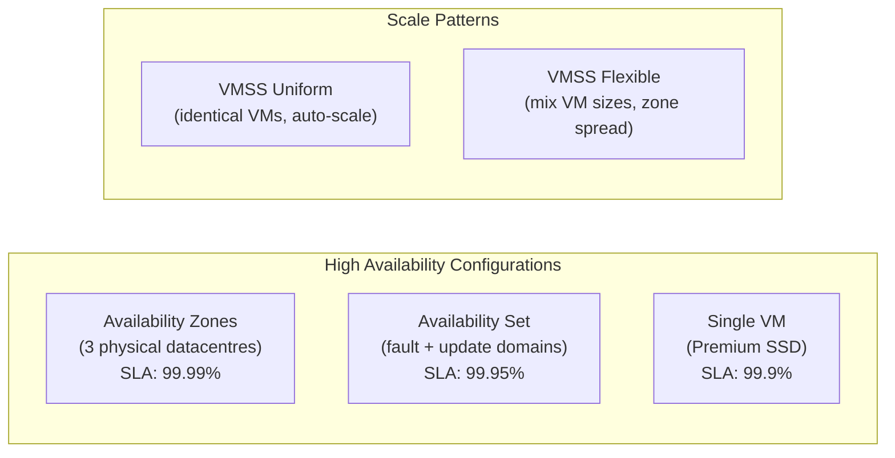

# 🖥️ Azure Virtual Machines & VMSS
{: .no_toc }

**IaaS foundation — full OS control, maximum compatibility, lift-and-shift workloads**
{: .fs-5 .fw-300 }

---

## Table of Contents
{: .no_toc .text-delta }

1. TOC
{:toc}

---

## Product Overview

Azure Virtual Machines (VMs) are the **IaaS compute foundation** of Azure — giving you full control over the operating system, installed software, and runtime environment. VMs are the right choice when PaaS or serverless options are not suitable due to compatibility requirements, legacy software, OS-level access needs, or licensing constraints.

**VM Scale Sets (VMSS)** extend VMs with automatic scaling, uniform or flexible orchestration, and rolling upgrades — enabling large-scale, elastic workloads on top of VMs.

---

## VM Series & Sizes

Azure VM sizes are grouped into families optimised for different workloads:

| Series | Family | Optimised For |
|--------|--------|--------------|
| **B** | Burstable | Dev/test, light workloads with CPU credits |
| **D / Ds** | General Purpose | Balanced CPU/memory; most common workload type |
| **E / Es** | Memory Optimised | In-memory databases, large caches (high RAM:CPU ratio) |
| **F / Fs** | Compute Optimised | High CPU:memory ratio; batch processing, web front-ends |
| **N** (NC/NV/ND) | GPU | Machine learning training, rendering, visualisation |
| **M** | Memory Extreme | SAP HANA, very large in-memory databases |
| **L / Ls** | Storage Optimised | High disk throughput and I/O; NoSQL, data warehousing |
| **H** | HPC | MPI workloads, molecular dynamics, financial simulation |

> ⚠️ **Exam Caveat — Series Selection:** The exam tests whether you can match a workload to the right VM family. Key anchors: **E-series = memory-heavy** (SAP, SQL in-memory), **F-series = CPU-heavy** (batch, gaming), **N-series = GPU** (AI/ML training), **B-series = burstable dev/test**.

---

## SLA
{: #sla }

| Configuration | SLA |
|--------------|-----|
| Single VM with Premium SSD | **99.9%** |
| Two or more VMs in an Availability Set | **99.95%** |
| Two or more VMs across Availability Zones | **99.99%** |

> ⚠️ **Exam Caveats:**
> - **Single VM SLA Requires Premium SSD:** A single VM only qualifies for the **99.9% SLA if all OS and data disks are Premium SSD or Ultra Disk**. Standard HDD/SSD disks remove the SLA guarantee entirely.
> - **99.99% Requires Availability Zones:** Availability Sets only reach **99.95%** — they protect against rack-level failures within one datacentre. Availability Zones span separate physical buildings and achieve **99.99%**. If the scenario requires the highest SLA, the answer is Availability Zones, not Availability Set.

---

## Availability Sets vs Availability Zones

| Property | Availability Set | Availability Zones |
|----------|-----------------|-------------------|
| Protection scope | Rack / power / network (single DC) | Separate physical datacentres |
| SLA | **99.95%** | **99.99%** |
| Fault domains | Up to 3 | 3 zones (1 per zone) |
| Update domains | Up to 20 | N/A (rolling per zone) |
| Zone-redundant storage | ❌ | ✅ recommended |
| Cost | No extra charge | No extra charge |
| Supports VMSS | ✅ | ✅ (zone-spanning) |

---

## Disk Types

| Disk Type | Use Case | Max IOPS | Max Throughput |
|-----------|----------|----------|---------------|
| **Ultra Disk** | Mission-critical, very high IOPS | 160,000 | 2,000 MB/s |
| **Premium SSD v2** | Production DBs, lower cost than Ultra | 80,000 | 1,200 MB/s |
| **Premium SSD** | Production workloads | 20,000 | 900 MB/s |
| **Standard SSD** | Web servers, light production | 6,000 | 750 MB/s |
| **Standard HDD** | Dev/test, backups, infrequent access | 2,000 | 500 MB/s |

> ⚠️ **Exam Caveat:** Only **Premium SSD, Premium SSD v2, or Ultra Disk** qualify a single VM for the **99.9% SLA**. Standard SSD and Standard HDD do not.

---

## VM Scale Sets (VMSS)

VMSS manages a group of identical (Uniform) or varied (Flexible) load-balanced VMs, supporting auto-scaling and rolling upgrades.

### Orchestration Modes

| Mode | Description | Use Case |
|------|-------------|----------|
| **Uniform** | All VMs are identical; managed as a fleet | Web tiers, batch workers, stateless services |
| **Flexible** | Mix of VM sizes; can add individual VMs | Mixed workloads, FD/UD zone spreading |

### Auto-scaling

VMSS auto-scaling is driven by **Azure Monitor metrics** or **schedule**:

| Scale Trigger | Example |
|--------------|---------|
| CPU percentage | Scale out when CPU > 75% for 5 min |
| Memory pressure | Scale out when available memory < 2 GB |
| Queue depth | Scale out when Storage Queue messages > 1,000 |
| Custom metric | Application-defined metric via App Insights |
| Schedule | Scale out at 08:00, scale in at 20:00 weekdays |

> ⚠️ **Exam Caveat — Scale-in Policy:** VMSS scale-in removes VMs according to a configurable policy (Default, NewestVM, OldestVM). The default policy balances across Availability Zones first, then removes the VM with the highest instance ID. If a stateful workload needs specific instances preserved, a **custom scale-in policy** is required.

---

## Reserved Instances & Cost Optimisation

| Option | Discount vs Pay-as-you-go | Commitment |
|--------|--------------------------|------------|
| **Pay-as-you-go** | Baseline | None |
| **1-year Reserved Instance** | Up to ~40% | 1 year |
| **3-year Reserved Instance** | Up to ~60% | 3 years |
| **Azure Spot VMs** | Up to ~90% | Evictable anytime |
| **Azure Hybrid Benefit** | Up to ~40% extra | Existing Windows/SQL licence |
| **Dev/Test pricing** | Significant discount | Visual Studio subscription required |

> ⚠️ **Exam Caveat — Spot VMs:** Spot VMs are the cheapest option but can be **evicted with 30 seconds' notice** when Azure needs the capacity back. They are only suitable for **fault-tolerant, interruptible workloads** such as batch processing, rendering, or dev/test — never for production databases or services requiring SLA guarantees.

---

## Networking

| Feature | Detail |
|---------|--------|
| **NIC** | Each VM has one or more NICs; attached to a VNet subnet |
| **Public IP** | Optional; SKU must match load balancer (Standard recommended) |
| **Network Security Group (NSG)** | Applied at NIC or subnet level to control inbound/outbound traffic |
| **Accelerated Networking** | SR-IOV for up to 30 Gbps throughput on supported VM sizes |
| **Private IP** | Static or dynamic from the subnet address space |
| **Load Balancer** | Standard LB (zone-redundant) or Application Gateway for HTTP/S |

---

## Azure Dedicated Hosts

For compliance or licensing requirements that mandate **single-tenant physical servers**:

| Feature | Detail |
|---------|--------|
| **Isolation** | Your VMs run on a dedicated physical host — no other customers' VMs |
| **Maintenance control** | You choose when Azure applies maintenance (within a 35-day window) |
| **Azure Hybrid Benefit** | Combine Dedicated Host with on-premises licences |
| **Pricing** | Per host (regardless of how many VMs run on it) |

---

## Common Exam Scenarios

| Scenario | Answer |
|----------|--------|
| Highest SLA for two VMs | **Availability Zones** (99.99%) |
| 99.9% SLA for a single VM | **Premium SSD** on all disks |
| Fault-tolerance within a single datacentre | **Availability Set** (99.95%) |
| Large-scale stateless web tier with auto-scale | **VMSS Uniform** mode |
| Cheapest compute for interruptible batch jobs | **Spot VMs** |
| Reduce Windows Server VM cost with existing licences | **Azure Hybrid Benefit** |
| Compliance requires physical isolation | **Azure Dedicated Hosts** |
| SAP HANA workload needing extreme memory | **M-series VMs** |
| GPU required for ML model training | **N-series VMs** |
| Scale out VMs on a CPU metric threshold | **VMSS auto-scale** via Azure Monitor |

---

[← Back to Home](/az-305-compute/) | [02 — Azure App Service →](/az-305-compute/02-app-service/)