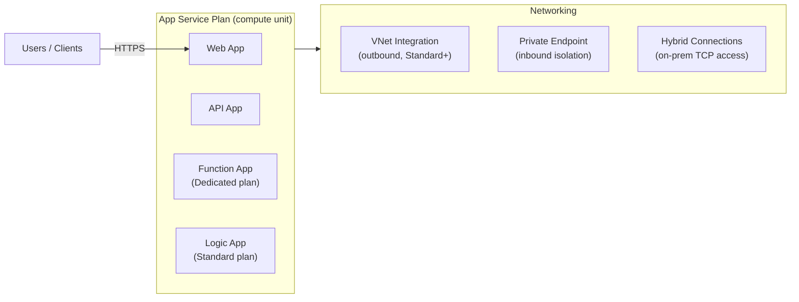

# 🌐 Azure App Service
{: .no_toc }

**Fully managed PaaS for web apps, REST APIs, and mobile back-ends**
{: .fs-5 .fw-300 }

---

## Table of Contents
{: .no_toc .text-delta }

1. TOC
{:toc}

---

## Product Overview

Azure App Service is a **fully managed PaaS** for hosting web applications, RESTful APIs, and mobile back-ends. It abstracts infrastructure management — no VMs, no OS patching, no runtime installation. You deploy code or containers; Azure handles the rest.

App Service supports multiple runtime stacks (.NET, Java, Node.js, Python, PHP, Ruby) and deployment from GitHub, Azure DevOps, Docker Hub, or local Git.

---

## Plans and Tiers
{: #plans-and-tiers }

The **App Service Plan** defines the region, number of VM instances, and pricing tier. All apps in a plan share the same compute resources.

| Tier | Category | Key Features | SLA |
|------|----------|-------------|-----|
| **Free (F1)** | Shared | 60 min/day CPU, no custom domain, no SLA | None |
| **Shared (D1)** | Shared | Custom domain, 240 min/day CPU | None |
| **Basic (B1–B3)** | Dedicated | Custom domain, manual scale (up to 3 instances), no auto-scale | **99.95%** |
| **Standard (S1–S3)** | Dedicated | Auto-scale, **5 deployment slots**, VNet Integration, custom SSL | **99.95%** |
| **Premium v2/v3 (P1–P3)** | Dedicated | **20 deployment slots**, zone redundancy, larger VMs, private endpoints | **99.95%** |
| **Isolated v2 (I1–I3)** | Dedicated VNet | App Service Environment v3 (ASEv3), fully VNet-isolated, private | **99.99%** |

> ⚠️ **Exam Caveat — Tier Feature Gates (Most Tested):**
> - **Auto-scale** requires **Standard or above** — Basic only supports manual scale to 3 instances
> - **Deployment slots** start at Standard (5 slots) — Premium has 20
> - **VNet Integration** (outbound to VNet resources) requires **Standard or above**
> - **Private Endpoints** (inbound isolation) require **Basic or above**
> - **Zone Redundancy** requires **Premium v2/v3 or Isolated**
> - **99.99% SLA** only with **App Service Environment (Isolated tier)**

---

## Deployment Slots

Deployment slots are **live environments** within the same App Service (e.g., staging, QA, production). Each slot is a separate app with its own hostname.

| Feature | Detail |
|---------|--------|
| Purpose | Blue/green deployments, testing before production swap |
| Swap | Atomic swap of two slots — zero downtime |
| Warm-up | Slot is warmed up before swap completes |
| Slot settings | Some app settings can be **slot-sticky** (not swapped) |
| Max slots | 5 (Standard) / **20** (Premium) |

> ⚠️ **Exam Caveat — Slot Swap Behaviour:** During a swap, the **staging slot becomes production** and vice versa. Slot-sticky settings stay with their slot. If the scenario mentions **zero-downtime deployments** or **canary releases**, the answer is deployment slots.

---

## Scaling

### Scale Up (Vertical)
Change the App Service Plan tier to a larger VM size — increases CPU, RAM, and disk. Causes a brief restart.

### Scale Out (Horizontal)
Add more instances of the same plan. **Auto-scale** (Standard+) adds/removes instances based on metrics or schedules.

| Scale Out Method | Trigger |
|-----------------|---------|
| **Manual** | Set a fixed instance count |
| **Metric-based auto-scale** | CPU %, memory %, HTTP queue length, custom App Insights metric |
| **Schedule-based auto-scale** | Fixed instance count at set times |
| **Predictive auto-scale** | ML-based pre-scaling before anticipated demand (Premium v2/v3) |

---

## Networking
{: #networking }

| Feature | Direction | Tier Requirement | Purpose |
|---------|-----------|-----------------|---------|
| **VNet Integration** | Outbound | Standard+ | App accesses resources in a VNet (e.g., private SQL MI, internal APIs) |
| **Private Endpoint** | Inbound | Basic+ | App only accessible from within a VNet; no public internet exposure |
| **Hybrid Connections** | Outbound | Basic+ | Access on-premises TCP resources without VNet (relay-based) |
| **App Service Environment (ASE)** | Both | Isolated | Fully VNet-injected dedicated environment for complete isolation |
| **Access restrictions** | Inbound | All tiers | IP-based allow/deny rules, Service Tag rules |
| **Service Endpoints** | Outbound | Standard+ | Restrict outbound to specific Azure services |

> ⚠️ **Exam Caveat — VNet Integration vs Private Endpoint:**
> - **VNet Integration** controls **outbound** traffic from the app — the app can reach private resources inside a VNet
> - **Private Endpoint** controls **inbound** traffic to the app — external clients cannot reach the app; only VNet-internal clients can
> - Both can be combined for fully private apps

> ⚠️ **Exam Caveat — Hybrid Connections vs VNet Integration:** Hybrid Connections use an **Azure Relay** service and do not require a VNet or VPN — they work on a per-TCP-endpoint basis and are ideal when a VNet is not available or overkill. VNet Integration gives broader access to the entire VNet address space.

---

## Security

| Feature | Detail |
|---------|--------|
| **Managed Identity** | System-assigned or user-assigned; access Key Vault, Storage, SQL without credentials |
| **Custom domains + TLS** | Bring your own certificate or use App Service managed certificates (free) |
| **Authentication / Authorisation** | Easy Auth — built-in Entra ID, Google, Facebook, GitHub sign-in with no code |
| **App Service Environment** | Dedicated, fully isolated compute with private ingress and egress |
| **Microsoft Defender for App Service** | Threat detection for web app attacks |
| **CORS** | Configure allowed origins in the Azure portal |

---

## App Service Environment (ASE) v3

ASEv3 is an **App Service deployment into a customer VNet** — a single-tenant, dedicated environment providing the highest isolation available in App Service.

| Feature | ASEv3 (Isolated v2 tier) |
|---------|--------------------------|
| Deployment | Into a delegated subnet in your VNet |
| Inbound traffic | Private IP only (Internal Load Balancer) |
| Outbound traffic | Via VNet (can use UDRs, NVA, ExpressRoute) |
| SLA | **99.99%** |
| Scale | Up to 200 total App Service plan instances |
| Zone redundancy | ✅ Supported |

> ⚠️ **Exam Caveat — ASEv2 vs ASEv3:** ASEv2 is retired. The exam references **ASEv3**. If the scenario requires **full VNet injection for inbound and outbound isolation**, ASEv3 is the answer. For outbound-only VNet access, VNet Integration is sufficient and much cheaper.

---

## Common Exam Scenarios

| Scenario | Answer |
|----------|--------|
| Zero-downtime deployment with rollback | **Deployment slots** (swap) |
| App needs to call a private SQL Managed Instance | **VNet Integration** (Standard+) |
| App must not be reachable from the public internet | **Private Endpoint** on the app |
| Full inbound + outbound VNet isolation | **App Service Environment v3** (Isolated tier) |
| Access on-premises database, no VNet available | **Hybrid Connections** |
| Auto-scale on HTTP queue length | **Metric-based auto-scale** (Standard+) |
| Reduce cost with sign-in via Entra ID, no code | **Easy Auth** |
| Canary release — 10% traffic to new version | **Deployment slot** + traffic routing % |
| Highest SLA for App Service | **App Service Environment** (Isolated, 99.99%) |
| Free SSL certificate for a custom domain | **App Service managed certificate** |

---

[← 01 — Azure Virtual Machines & VMSS](/az-305-compute/01-virtual-machines/) | [03 — Azure Kubernetes Service →](/az-305-compute/03-aks/)