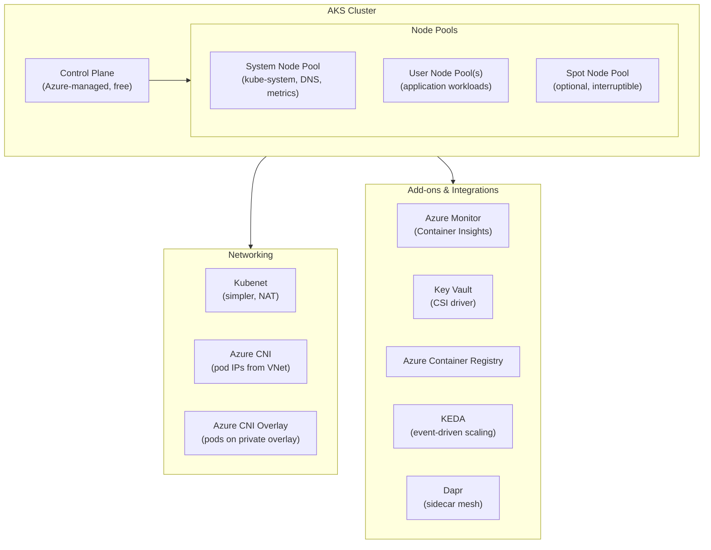

# 🐳 Azure Kubernetes Service (AKS)
{: .no_toc }

**Fully managed Kubernetes — microservices orchestration with full control**
{: .fs-5 .fw-300 }

---

## Table of Contents
{: .no_toc .text-delta }

1. TOC
{:toc}

---

## Product Overview

Azure Kubernetes Service (AKS) is a **managed Kubernetes service** that offloads cluster control-plane management (API server, etcd, scheduler) to Azure — you only manage and pay for the **worker nodes**. AKS is the right choice when you need **full Kubernetes flexibility**: custom controllers, advanced networking, stateful workloads, GPU scheduling, or fine-grained resource control at scale.

---

## Node Pools

| Pool Type | Purpose | Notes |
|-----------|---------|-------|
| **System** | Runs Kubernetes system pods (DNS, metrics-server) | Every cluster needs at least one; taint prevents app pods |
| **User** | Runs application workloads | One or more; different VM sizes per pool |
| **Spot** | Uses Azure Spot VMs — up to 90% cheaper | Evictable; use for fault-tolerant batch workloads |
| **Virtual nodes** | Burst to Azure Container Instances | Instant scale-out without provisioning nodes |

> ⚠️ **Exam Caveat — System vs User Node Pool:** You cannot delete the system node pool while the cluster exists. For compliance or isolation, application workloads should use a **dedicated User node pool** with taints/tolerations to prevent system pods from co-locating.

---

## Networking
{: #networking }

| Mode | How Pods Get IPs | Pros | Cons |
|------|-----------------|------|------|
| **Kubenet** | NAT from node IP; pods share node IP | Simpler, smaller IP usage | No direct pod-to-pod routing from VNet; requires UDRs for hybrid access |
| **Azure CNI** | Each pod gets a real VNet IP | Full VNet routing, accessible from on-prem | Requires large IP address space (nodes × max_pods) |
| **Azure CNI Overlay** | Pods on private CIDR overlay; nodes get VNet IPs | Reduces IP consumption vs CNI | Slightly more complexity |
| **Azure CNI Powered by Cilium** | eBPF-based networking | High performance, network policy, Hubble observability | Newer; not supported on all scenarios |

> ⚠️ **Exam Caveat — Kubenet vs Azure CNI:** If the scenario mentions **pods must be directly reachable from on-premises** or from other VNet resources **without NAT**, the answer is **Azure CNI** (pods get real VNet IPs). Kubenet uses NAT and pods are not directly routable from outside the cluster.

### Network Policy

| Engine | Notes |
|--------|-------|
| **Calico** | Open-source; supports Kubenet and Azure CNI |
| **Azure Network Policy** | Native Azure; Azure CNI only |
| **Cilium** | eBPF-based; Azure CNI Powered by Cilium only |

---

## RBAC & Security

| Feature | Detail |
|---------|--------|
| **Kubernetes RBAC** | Role/ClusterRole + RoleBinding/ClusterRoleBinding inside the cluster |
| **Azure RBAC for Kubernetes** | Entra ID groups/users mapped to Kubernetes RBAC — no kubeconfig credential management |
| **Workload Identity** | Pods authenticate to Azure services via Entra ID managed identity (replaces Pod Identity) |
| **Key Vault CSI Driver** | Mount secrets from Azure Key Vault directly into pod file systems |
| **Microsoft Defender for Containers** | Runtime threat detection, image scanning, Kubernetes audit log analysis |
| **Private cluster** | AKS API server exposed only on a private IP within the VNet |

> ⚠️ **Exam Caveat — Azure RBAC vs Kubernetes RBAC:** With **Azure RBAC for Kubernetes**, you manage access through Entra ID and Azure role assignments — no need to distribute kubeconfig files or manage local Kubernetes accounts. This is the preferred model for enterprise environments.

---

## Scaling

| Mechanism | Description |
|-----------|-------------|
| **Horizontal Pod Autoscaler (HPA)** | Scales pod replicas based on CPU, memory, or custom metrics |
| **Vertical Pod Autoscaler (VPA)** | Adjusts pod CPU/memory requests and limits automatically |
| **Cluster Autoscaler** | Adds or removes **nodes** when pods cannot be scheduled (scale-out) or nodes are underutilised (scale-in) |
| **KEDA** | Event-driven scaling of pods based on external event sources (queues, Event Hubs, HTTP) |
| **Virtual Nodes (ACI burst)** | Instantly burst workloads to ACI without provisioning new nodes |

> ⚠️ **Exam Caveat — Cluster Autoscaler vs HPA:** HPA scales **pods**; Cluster Autoscaler scales **nodes**. They complement each other: HPA adds pods → if no capacity, Cluster Autoscaler adds nodes. Both should be enabled together for elastic production workloads.

---

## Upgrades

AKS supports **Kubernetes version upgrades** for both the control plane and node pools:

| Upgrade Type | Detail |
|-------------|--------|
| **Control plane** | Upgraded first; backward-compatible with N-2 node pool versions |
| **Node pool** | Upgraded separately after control plane; can be staged |
| **Node surge** | Extra nodes provisioned during upgrade to maintain capacity (configurable %) |
| **Auto-upgrade channels** | `patch`, `stable`, `rapid`, `node-image` — automated upgrade cadence |

> ⚠️ **Exam Caveat:** AKS only supports the **latest 3 minor Kubernetes versions** (N, N-1, N-2). If a cluster runs an unsupported version, it cannot be upgraded — a new cluster may be required.

---

## SLA

| Configuration | SLA |
|--------------|-----|
| Free control plane tier | No SLA |
| **Standard tier** (paid control plane) | **99.95%** |
| Standard tier + **Availability Zones** | **99.99%** |

> ⚠️ **Exam Caveat:** The AKS control plane SLA (**99.95% / 99.99%**) requires the **Standard tier** (not free). Free tier clusters have no uptime guarantee — suitable only for dev/test.

---

## Monitoring

| Tool | Coverage |
|------|---------|
| **Container Insights** (Azure Monitor) | Node/pod CPU, memory, logs, live data |
| **Prometheus + Grafana** | Open-source metrics; Azure Managed Prometheus available |
| **Azure Monitor Alerts** | Alert on pod restarts, node CPU, OOM events |
| **Kubernetes Events** | Cluster-level event stream for scheduling, scaling, errors |

---

## Common Exam Scenarios

| Scenario | Answer |
|----------|--------|
| Full Kubernetes control, custom controllers | **AKS** |
| Pods must be directly routable from on-premises | **AKS + Azure CNI** |
| Manage cluster access via Entra ID groups | **Azure RBAC for Kubernetes** |
| Auto-scale pods on Event Hub message count | **KEDA** on AKS |
| Burst to immediate capacity without new nodes | **Virtual Nodes** (ACI integration) |
| Highest AKS SLA | Standard tier + **Availability Zones** (99.99%) |
| Protect API server from public internet | **Private AKS cluster** |
| Mount Key Vault secrets into pod filesystem | **Key Vault CSI Driver** |
| Automated patch version upgrades | **Auto-upgrade channel: patch** |
| Cost-optimise interruptible batch node pool | **Spot node pool** |

---

[← 02 — Azure App Service](/az-305-compute/02-app-service/) | [04 — Azure Container Instances →](/az-305-compute/04-container-instances/)