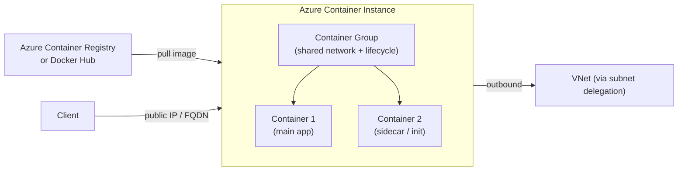

# 📦 Azure Container Instances
{: .no_toc }

**Serverless containers — fastest way to run a container in Azure, no orchestration needed**
{: .fs-5 .fw-300 }

---

## Table of Contents
{: .no_toc .text-delta }

1. TOC
{:toc}

---

## Product Overview

Azure Container Instances (ACI) is the **simplest and fastest way to run containers in Azure** — no VMs, no orchestrators, no cluster management. You define a container image, CPU and memory, and ACI runs it in seconds, billing per second of use.

ACI is designed for **short-lived, isolated, or burst workloads** where you need container flexibility without the overhead of Kubernetes or VMSS. It is also used as the **burst layer for AKS virtual nodes**.

---

## Core Concepts

### Container Groups
A **container group** is the top-level ACI resource — a collection of containers scheduled on the same host that share a network (IP address, ports) and storage (volume mounts). This is analogous to a Kubernetes Pod.

| Property | Detail |
|----------|--------|
| Shared lifecycle | All containers in a group start and stop together |
| Shared network | One IP address; containers communicate on localhost |
| Multi-container | Supported — run a sidecar or init container alongside the main app |
| OS | Windows or Linux (not mixed in the same group) |

### Restart Policies

| Policy | Behaviour | Use Case |
|--------|-----------|----------|
| **Always** | Restart on any exit | Long-running services |
| **OnFailure** | Restart only on non-zero exit code | Batch jobs that may fail |
| **Never** | Never restart | One-off tasks, CI steps |

> ⚠️ **Exam Caveat — Restart Policy for Batch Jobs:** For a batch job that must run to completion and then stop, use **`OnFailure`** — the container restarts if it crashes but terminates normally on success. `Never` is for single-run tasks where even crashes should not retry.

---

## Limits & Quotas

| Resource | Limit |
|----------|-------|
| Max vCPUs per container group | **4 vCPU** |
| Max memory per container group | **16 GB** |
| Max containers per group | 60 |
| Max persistent volumes | Azure Files share mount |
| GPU support | Limited (N-series preview) |

> ⚠️ **Exam Caveat:** ACI is unsuitable for compute-intensive workloads requiring **> 4 vCPUs**. For those, use AKS, VMSS, or a VM.

---

## Networking

| Mode | Description |
|------|-------------|
| **Public IP** | Default; container group gets a public IP and optional FQDN |
| **VNet integration** | Deploy into a dedicated subnet (delegated to `Microsoft.ContainerInstance/containerGroups`); gets a private IP |
| **No public IP** | VNet-only deployment for fully private access |

> ⚠️ **Exam Caveat — ACI VNet Restrictions:** When ACI is deployed into a VNet subnet, it gets a private IP but **loses the ability to pull images from public Docker Hub** (unless outbound internet access is configured via NAT Gateway or firewall). Plan image pull strategy when using VNet-deployed ACI.

---

## Storage — Persistent Volumes

ACI containers are ephemeral by default. For persistence, mount an **Azure Files** share:

| Volume Type | Detail |
|-------------|--------|
| **Azure Files** | SMB 3.0 share; persists data across container restarts |
| **Azure Disk** | Block storage; single-container-group access only |
| **Empty dir** | Ephemeral; shared between containers in the same group |
| **gitRepo** | Clones a Git repo at container start |

---

## Security

| Feature | Detail |
|---------|--------|
| **Managed Identity** | System or user-assigned; access Key Vault, ACR, Storage |
| **Confidential containers** | Hardware-based TEE for sensitive data workloads |
| **Private image registry** | Pull from ACR using managed identity or registry credentials |
| **Secret environment variables** | Variables marked as secret are not shown in portal/CLI |

---

## Pricing

ACI is billed per second of execution:

| Resource | Billing |
|----------|---------|
| vCPU | Per vCPU-second |
| Memory | Per GB-second |
| Windows containers | Higher rate than Linux |

> ⚠️ **Exam Caveat — ACI Cost vs AKS:** ACI is cheapest for **infrequent, short-lived containers**. For containers that run continuously (hours per day), AKS or App Service is more cost-effective — ACI's per-second billing adds up for long-running workloads.

---

## Common Exam Scenarios

| Scenario | Answer |
|----------|--------|
| Run a one-off scheduled batch container job | **ACI** with `OnFailure` restart policy |
| Burst AKS capacity immediately without new nodes | **AKS Virtual Nodes** (backed by ACI) |
| Simple container with no orchestration, no long running | **ACI** |
| Container needs >4 vCPU or >16 GB RAM | **AKS or VMSS** (not ACI) |
| Container must be on a private VNet only | **ACI with VNet subnet delegation** |
| Run sidecar alongside main container, shared network | **ACI Container Group** (multi-container) |
| Persistent storage across container restarts | **ACI + Azure Files volume mount** |
| Cheapest compute for a 5-minute nightly container job | **ACI** (pay-per-second, ~5 min billing) |

---

[← 03 — Azure Kubernetes Service](/az-305-compute/03-aks/) | [05 — Azure Container Apps →](/az-305-compute/05-container-apps/)