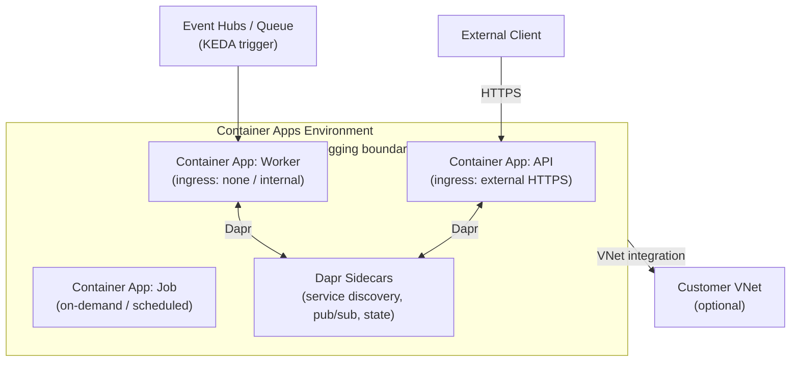

# ☁ Azure Container Apps
{: .no_toc }

**★ Serverless container platform — event-driven microservices without managing Kubernetes**
{: .fs-5 .fw-300 }

---

## Table of Contents
{: .no_toc .text-delta }

1. TOC
{:toc}

---

## Product Overview

Azure Container Apps (ACA) is a **fully managed serverless container platform** built on Kubernetes and KEDA under the hood — but you never interact with Kubernetes directly. It is designed for **event-driven microservices, background workers, API back-ends, and long-running services** that need container flexibility but without Kubernetes cluster management.

Container Apps is the **recommended answer** on AZ-305 whenever a scenario describes containers needing auto-scale to zero, KEDA-based event scaling, Dapr integration, or traffic splitting — without requiring full Kubernetes control.



---

## Core Concepts

### Container Apps Environment

The **environment** is the isolation and networking boundary — all apps in an environment share a virtual network and a Log Analytics workspace. You can have multiple environments per subscription.

| Property | Detail |
|----------|--------|
| Network | All apps share one VNet integration (Consumption plan) or dedicated subnet (Dedicated plan) |
| Logging | Shared Log Analytics workspace |
| Isolation | Apps in different environments cannot communicate directly |
| Deployment | One environment per region |

### Revisions

A **revision** is an immutable snapshot of a Container App version. When you update an app (new image, env vars, scale rules), a new revision is created.

| Feature | Detail |
|---------|--------|
| Revision modes | **Single** (one active revision) or **Multiple** (split traffic between revisions) |
| Traffic splitting | Route X% to revision A, Y% to revision B — enables blue/green and canary |
| Revision lifecycle | Revisions can be activated, deactivated, or set to receive 0% traffic |

> ⚠️ **Exam Caveat — Revisions for Zero-Downtime Deployments:** Container Apps revisions with **traffic splitting** are the serverless equivalent of App Service deployment slots. If the scenario mentions canary or blue/green deployments on a serverless container platform, the answer is **Container Apps revision traffic splitting**.

---

## Scaling
{: #scaling }

Container Apps scaling is driven by **KEDA (Kubernetes Event-Driven Autoscaler)** — the same open-source project that powers event-driven scaling in AKS.

### Scale to Zero

Container Apps can scale **down to zero replicas** when there is no traffic or events — eliminating compute cost during idle periods. On the next request or event, the app scales up from zero (with a brief cold start).

> ⚠️ **Exam Caveat — Scale-to-Zero vs Always-On:** Scale-to-zero is ideal for cost savings on bursty or intermittent workloads. If the scenario requires **zero cold start / always ready**, set the **minimum replicas to 1 or more**.

### Scale Triggers (KEDA)

| Trigger Type | Example Source |
|-------------|---------------|
| **HTTP** | Requests per second, concurrent requests |
| **CPU / Memory** | Resource utilisation |
| **Azure Service Bus** | Queue message count, topic subscription backlog |
| **Azure Event Hubs** | Consumer lag (unprocessed events) |
| **Azure Storage Queue** | Message count |
| **Azure Blob Storage** | Blob count or size |
| **Custom KEDA scaler** | Any KEDA-compatible external source |

### Scale Rules Example

```yaml
scale:
  minReplicas: 0
  maxReplicas: 30
  rules:
    - name: service-bus-scaler
      custom:
        type: azure-servicebus
        metadata:
          queueName: orders
          messageCount: "20"   # scale out 1 replica per 20 messages
```

---

## Ingress

| Ingress Type | Accessible From | Use Case |
|-------------|----------------|----------|
| **External** | Public internet via managed HTTPS endpoint | Public-facing APIs, web front-ends |
| **Internal** | Within the environment only | Microservice-to-microservice communication |
| **None** | No HTTP ingress | Background workers, event consumers |

Container Apps provides a **fully managed TLS certificate** for all external endpoints — no certificate management required.

> ⚠️ **Exam Caveat:** Container Apps with **internal ingress** can only be reached from apps in the **same environment** or from resources in the integrated VNet. They are not reachable from the public internet.

---

## Dapr Integration

**Dapr (Distributed Application Runtime)** is a sidecar that simplifies common microservice patterns — without adding application code:

| Dapr Building Block | What It Provides |
|--------------------|-----------------|
| **Service invocation** | Reliable HTTP/gRPC service discovery and retries between Container Apps |
| **Pub/Sub** | Decouple producers and consumers via Service Bus, Event Hubs, or Redis |
| **State management** | Key-value state backed by Redis, Cosmos DB, or Azure Table Storage |
| **Bindings** | Trigger app from or output to external systems (Blob, queues, etc.) |
| **Secrets** | Unified secret access across Key Vault and environment secrets |

> ⚠️ **Exam Caveat:** Dapr is an **opt-in sidecar** — you enable it per Container App, not globally. Dapr is the correct answer when the scenario describes microservices needing **service-to-service discovery, pub/sub, or state management without writing infrastructure code**.

---

## Jobs

**Container Apps Jobs** run containerised tasks on demand, on a schedule, or triggered by events — similar to Kubernetes Jobs but fully managed.

| Job Trigger | Description |
|------------|-------------|
| **Manual** | Triggered via CLI, API, or CI/CD pipeline |
| **Scheduled** | Cron expression (e.g., daily at 02:00) |
| **Event-driven** | KEDA trigger (e.g., process each message in a queue as a separate job execution) |

> ⚠️ **Exam Caveat — Container Apps Jobs vs Azure Functions:** For **short-lived event-driven tasks running in containers**, Container Apps Jobs is the answer. For **short-lived functions in code** (C#, Python, Node.js), Azure Functions is the answer.

---

## Networking

| Feature | Consumption Plan | Dedicated Plan |
|---------|-----------------|---------------|
| **VNet integration** | ✅ (shared, no dedicated subnet) | ✅ (dedicated subnet) |
| **Private ingress** | ✅ (internal ingress) | ✅ |
| **Custom VNet** | ✅ (at environment creation) | ✅ |
| **Private Endpoints** | ❌ | ✅ |
| **User-defined routes (UDR)** | ❌ | ✅ |

> ⚠️ **Exam Caveat — Consumption vs Dedicated Plan for Networking:** If the scenario requires **UDR-based egress control** (e.g., all outbound traffic through an NVA or Azure Firewall), the Container Apps environment must use the **Dedicated plan**. Consumption plan does not support UDR.

---

## Plans & Pricing

| Plan | Billing | Use Case |
|------|---------|----------|
| **Consumption** | Per vCPU-second + GB-second (scale to zero = zero cost) | Bursty, event-driven, cost-sensitive |
| **Dedicated** | Per dedicated instance (always-on) | Predictable workloads, UDR, private endpoints |

---

## Security

| Feature | Detail |
|---------|--------|
| **Managed Identity** | System or user-assigned; authenticate to ACR, Key Vault, Service Bus without secrets |
| **Secrets** | Environment-level or app-level secrets; referenced in env vars or Dapr |
| **Key Vault references** | Secrets pulled from Key Vault at runtime via managed identity |
| **Entra ID auth** | Easy Auth — built-in sign-in for external-facing apps |
| **mTLS between Dapr sidecars** | Automatic mutual TLS between Dapr-enabled apps in the same environment |

---

## Common Exam Scenarios

| Scenario | Answer |
|----------|--------|
| Serverless containers, scale to zero, no Kubernetes | **Azure Container Apps** |
| Scale containers based on Service Bus queue depth | **Container Apps + KEDA Service Bus scaler** |
| Blue/green or canary release on a containerised API | **Container Apps revision traffic splitting** |
| Microservices needing pub/sub without infrastructure code | **Container Apps + Dapr pub/sub** |
| Scheduled nightly container batch job, serverless | **Container Apps Job** (scheduled trigger) |
| All egress through Azure Firewall from containers | **Container Apps Dedicated plan** (supports UDR) |
| Need full Kubernetes control (custom CRDs, controllers) | **AKS** (not Container Apps) |
| Containerised worker consuming Event Hub events | **Container Apps + KEDA Event Hub scaler** |
| Cheapest option for a container that runs 10 min/day | **Container Apps Consumption** (or ACI) |

---

[← 04 — Azure Container Instances](/az-305-compute/04-container-instances/) | [06 — Azure Functions →](/az-305-compute/06-azure-functions/)