# ⚡ Azure Functions
{: .no_toc }

**★ Serverless compute — event-driven, trigger-based code execution at any scale**
{: .fs-5 .fw-300 }

---

## Table of Contents
{: .no_toc .text-delta }

1. TOC
{:toc}

---

## Product Overview

Azure Functions is a **serverless compute service** that runs small units of code (functions) in response to triggers — without provisioning or managing servers. You pay only for the time your code executes. Functions is the right answer when the workload is **event-driven, short-lived, and stateless** — reacting to HTTP requests, queue messages, timer events, blob uploads, or any Azure service event.

```mermaid
flowchart LR
    subgraph Triggers["Triggers (what starts a function)"]
        HTTP["HTTP Request"]
        TMR["Timer (cron)"]
        SBQ["Service Bus Queue/Topic"]
        STQ["Storage Queue"]
        EH["Event Hub"]
        EG["Event Grid"]
        BLOB["Blob Storage"]
        COD["Cosmos DB (change feed)"]
    end
    subgraph FA["Function App"]
        F1["Function 1\n(HTTP trigger)"]
        F2["Function 2\n(Queue trigger)"]
        F3["Function 3\n(Timer trigger)"]
    end
    subgraph Outputs["Output Bindings (what the function writes)"]
        SQLO["Storage Queue"]
        SBO["Service Bus"]
        COSMO["Cosmos DB"]
        BLOBO["Blob Storage"]
        TABLEO["Table Storage"]
        SIGR["SignalR"]
    end
    Triggers --> FA
    FA --> Outputs
```



---

## Hosting Plans
{: #hosting-plans }

The hosting plan is the **most exam-critical decision** for Azure Functions — it determines scaling behaviour, cost, VNet support, cold start exposure, and execution duration limits.

| Feature | Consumption | Premium | Dedicated (App Service) |
|---------|------------|---------|------------------------|
| **Billing** | Per execution + GB-s | Per pre-warmed instance | Per App Service Plan hour |
| **Scale** | Auto (0 → N) | Auto (min 1 → N) | Manual or auto-scale |
| **Scale to zero** | ✅ | ❌ (min 1 pre-warmed) | ❌ |
| **Cold start** | ✅ Yes (after idle) | ❌ No (pre-warmed) | ❌ No |
| **Max execution duration** | **10 minutes** | **60 minutes** (unlimited for Premium) | Unlimited |
| **VNet Integration** | ❌ | ✅ | ✅ |
| **Private Endpoints** | ❌ | ✅ | ✅ |
| **VNET trigger support** | ❌ | ✅ | ✅ |
| **Custom VM size** | ❌ | ✅ (EP1–EP3) | ✅ |
| **Always Ready instances** | ❌ | ✅ (configurable) | N/A |
| **Best for** | Bursty, cost-sensitive | No cold start, VNet access | Predictable load, existing App Service Plan |

> ⚠️ **Exam Caveat — Consumption Plan Limitations (Most Tested):**
> - **No VNet Integration** — cannot reach private resources (SQL MI, internal APIs) without Premium
> - **10-minute execution timeout** — long-running operations must use Durable Functions or Premium plan
> - **Cold starts** — first invocation after idle period has latency; unacceptable for latency-sensitive paths
> - **No private inbound** — function endpoint is always public on Consumption

> ⚠️ **Exam Caveat — Premium Plan vs Dedicated:**
> - Use **Premium** when you need auto-scale AND no cold start AND VNet Integration
> - Use **Dedicated** when the Function App should share an existing App Service Plan and you want predictable billing
> - Premium has a **minimum of 1 always-ready instance** — you always pay for at least one instance

---

## Triggers & Bindings

Functions use a **declarative** trigger and binding model — no SDK calls needed to read from a queue or write to a database; the runtime handles it.

### Key Triggers

| Trigger | Fires When |
|---------|-----------|
| **HTTP** | An HTTP/HTTPS request is received |
| **Timer** | A cron expression fires (e.g., `0 0 2 * * *` = 2am daily) |
| **Service Bus** | A message arrives in a queue or topic subscription |
| **Storage Queue** | A message appears in an Azure Storage Queue |
| **Event Hub** | Events arrive in an Event Hub partition |
| **Event Grid** | An Event Grid event is delivered via webhook |
| **Blob Storage** | A blob is created or modified (event-based or polling) |
| **Cosmos DB** | Documents change in a Cosmos DB container (change feed) |
| **Durable Orchestrator** | Called by a Durable Functions orchestration |

### Input & Output Bindings

Bindings let functions read from and write to services **without boilerplate code**:

```csharp
// HTTP trigger → reads from Cosmos DB → writes to Storage Queue
[FunctionName("ProcessOrder")]
public static async Task<IActionResult> Run(
    [HttpTrigger(AuthorizationLevel.Function, "post")] HttpRequest req,
    [CosmosDB("orders", "pending", SqlQuery = "SELECT * FROM c WHERE c.id = {id}")] IEnumerable<Order> orders,
    [Queue("processed-orders")] IAsyncCollector<string> outputQueue)
```

---

## Durable Functions

**Durable Functions** is an extension of Azure Functions that enables **stateful, long-running workflows** using code — without managing state, retries, or timers externally.

### Patterns

| Pattern | Description | Use Case |
|---------|-------------|----------|
| **Function Chaining** | Execute functions sequentially, pass output → input | Order processing pipeline |
| **Fan-out / Fan-in** | Invoke many functions in parallel, aggregate results | Parallel data processing |
| **Async HTTP API** | Client polls for long-running operation status | Document processing |
| **Monitor** | Flexible recurring check until condition met | Watch for external event |
| **Human Interaction** | Pause workflow waiting for external approval | Approval workflows |
| **Aggregator (Entity)** | Stateful singleton actor accumulating events over time | IoT device shadow |

> ⚠️ **Exam Caveat — When to Use Durable Functions:** Standard Functions have a **10-minute timeout** on the Consumption plan. For workflows that span minutes, hours, or days — or that require waiting for external events (human approval, external API call-back) — the answer is **Durable Functions**. Durable Functions store state in Azure Storage automatically.

### Durable Function Roles

| Role | Description |
|------|-------------|
| **Orchestrator** | Defines the workflow; must be deterministic; never does I/O directly |
| **Activity** | Does the actual work (I/O, computation); called by orchestrator |
| **Entity** | Stateful actor; manages state over time (counter, accumulator) |
| **Client** | Starts and queries orchestrations |

---

## Cold Start Deep Dive

Cold start occurs when a Consumption plan function app has been idle and a new instance must be provisioned:

| Factor | Impact on Cold Start |
|--------|---------------------|
| **Runtime** | .NET in-process < .NET isolated < Java / Python |
| **Package size** | Larger packages = longer cold start |
| **VNet Integration** | Not available on Consumption; Premium with VNet adds slight overhead |
| **Always Ready instances** | Premium plan; pre-warmed instances with zero cold start |

> ⚠️ **Exam Caveat:** If the scenario mentions **latency-sensitive** operations or SLAs that cannot tolerate variable cold-start delays, the answer is **Premium plan** with Always Ready instances — not Consumption.

---

## Security

| Feature | Detail |
|---------|--------|
| **Function-level auth keys** | `Anonymous`, `Function` (key required), `Admin` (master key) |
| **Managed Identity** | Authenticate to Azure services without credentials in code |
| **Key Vault references** | `@Microsoft.KeyVault(SecretUri=...)` in app settings |
| **Private Endpoints** | Inbound isolation (Premium/Dedicated only) |
| **VNet Integration** | Outbound to private resources (Premium/Dedicated only) |
| **IP restrictions** | Allow/deny inbound traffic by IP or CIDR |
| **Entra ID (Easy Auth)** | Token-based authentication for HTTP-triggered functions |

---

## Deployment & DevOps

| Method | Notes |
|--------|-------|
| **Zip deploy** | Upload a zip archive; recommended for CI/CD |
| **Run from package** | Mount zip directly from Blob Storage; cold start improved |
| **GitHub Actions / Azure DevOps** | CI/CD pipeline integration |
| **Deployment slots** | Available on Premium and Dedicated plans (not Consumption) |
| **Azure Functions Core Tools** | Local development and publish via CLI |

> ⚠️ **Exam Caveat — Deployment Slots on Functions:** Deployment slots for Functions are only available on **Premium or Dedicated (App Service) plans** — not on the Consumption plan.

---

## Common Exam Scenarios

| Scenario | Answer |
|----------|--------|
| Cheapest, event-driven, bursty HTTP function | **Consumption plan** |
| Function must call a SQL Managed Instance in a VNet | **Premium plan** (VNet Integration) |
| No cold start allowed, scales automatically | **Premium plan** (Always Ready instances) |
| Long-running workflow (hours) with human approval step | **Durable Functions** (Human Interaction pattern) |
| Run function every day at midnight | **Timer trigger** |
| Process each Service Bus message as a function | **Service Bus trigger** |
| Function must be completely private, no public endpoint | **Premium + Private Endpoint** |
| Fan-out: process 1000 items in parallel | **Durable Functions Fan-out/Fan-in** |
| Stateful actor accumulating IoT sensor events | **Durable Entities** |
| Share existing App Service Plan with a web app | **Dedicated (App Service) plan** |
| Deployment slots for staged function releases | **Premium or Dedicated plan** (not Consumption) |

---

[← 05 — Azure Container Apps](/az-305-compute/05-container-apps/) | [07 — Azure Logic Apps →](/az-305-compute/07-logic-apps/)