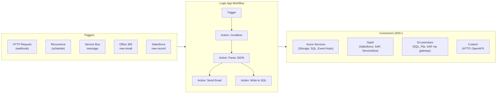

# 🔗 Azure Logic Apps
{: .no_toc }

**★ Serverless workflow automation — no-code/low-code integration and B2B orchestration**
{: .fs-5 .fw-300 }

---

## Table of Contents
{: .no_toc .text-delta }

1. TOC
{:toc}

---

## Product Overview

Azure Logic Apps is a **serverless, cloud-based workflow automation service** that lets you build automated workflows connecting applications, data, services, and systems — with minimal or no code. It uses a visual designer with **500+ pre-built connectors** covering Azure services, SaaS applications (Salesforce, Office 365, ServiceNow), on-premises systems, and custom HTTP endpoints.

Logic Apps is Azure's answer for **business process automation, enterprise integration (EAI), B2B trading partner workflows, and light orchestration** — where teams prefer no-code/low-code over writing Functions code.



---

## Hosting Models
{: #hosting-models }

Logic Apps has two hosting models with significant differences — this is the **most exam-tested distinction**:

| Feature | Consumption | Standard |
|---------|------------|----------|
| **Hosting** | Multi-tenant, fully managed | Single-tenant, Azure App Service-based |
| **Workflows per instance** | 1 workflow per Logic App | **Multiple workflows** in one Logic App |
| **Pricing** | Per action execution | Per App Service Plan hour + execution |
| **VNet Integration** | ❌ | ✅ |
| **Private Endpoints** | ❌ | ✅ |
| **On-premises connector** | Via **Data Gateway** (agent-based) | Via VNet Integration (direct) |
| **ISE (Integration Service Environment)** | Replaced by Standard | N/A |
| **Stateful workflows** | ✅ | ✅ |
| **Stateless workflows** | ❌ | ✅ |
| **Deployment** | Portal / ARM / Bicep | Portal / ARM / VS Code / CI-CD |
| **SLA** | **99.9%** | **99.95%** |
| **Built-in connectors** | Limited set | Extended set (run in-process) |

> ⚠️ **Exam Caveat — ISE is Retired:** The **Integration Service Environment (ISE)** was retired in August 2024. All ISE capabilities (VNet injection, dedicated resources, private endpoints) are now delivered by **Logic Apps Standard**. If an exam question references ISE for VNet connectivity, the modern answer is **Logic Apps Standard**.

> ⚠️ **Exam Caveat — VNet Connectivity:** If the scenario requires Logic Apps to connect to **private resources** (SQL MI, on-premises systems without a public endpoint, internal APIs), the answer is **Logic Apps Standard** — not Consumption. Consumption can only reach public endpoints or use the on-premises Data Gateway.

---

## Connectors

Connectors are grouped into categories:

| Category | Examples | Notes |
|----------|---------|-------|
| **Built-in** | HTTP, Schedule, Request, Azure Functions, Service Bus | Run in-process; faster, no connection management |
| **Managed (Azure-hosted)** | Office 365, Salesforce, SharePoint, SQL, Blob | Hosted in Microsoft's multi-tenant connector service |
| **On-premises** | SQL Server, File System, SAP, Oracle | Require **On-premises Data Gateway** (Consumption) or VNet (Standard) |
| **Enterprise** | SAP, IBM MQ, IBM 3270 | Premium connectors; licensed separately |
| **Custom** | OpenAPI spec, HTTP webhooks | Bring-your-own connector via OpenAPI |

> ⚠️ **Exam Caveat — On-premises Data Gateway:** For Consumption plan to reach on-premises systems, the **On-premises Data Gateway** must be installed on a machine with network access to the on-premises resource. It acts as a relay agent. Standard plan does not need the gateway if VNet Integration is configured.

---

## Stateful vs Stateless Workflows (Standard only)

| Mode | State Storage | Use Case | History |
|------|--------------|----------|---------|
| **Stateful** | State stored in external storage (Azure Storage) | Long-running, reliable, survives restarts | Full run history available |
| **Stateless** | In-memory only | Low-latency, short-duration workflows | No persistent history |

> ⚠️ **Exam Caveat — Stateless Workflows:** Stateless workflows in Logic Apps Standard are **faster and cheaper** but have **no replay, no history, and no persistence** — a restart loses state. Use stateless for workflows that complete in seconds and do not require auditing.

---

## B2B & Enterprise Integration

Logic Apps is Azure's primary platform for **B2B trading partner integration** and **enterprise application integration (EAI)**:

| Feature | Detail |
|---------|--------|
| **Integration Account** | Repository for B2B artefacts: partners, agreements, schemas, maps, certificates |
| **EDI** | AS2, X12, EDIFACT message exchange with trading partners |
| **XML processing** | XML validation, XSLT transformation, XPath extraction |
| **Flat file encoding/decoding** | Convert flat files to/from XML |
| **RosettaNet** | Industry-specific B2B protocol support |

> ⚠️ **Exam Caveat — Integration Account Tiers:**
>
> | Tier | Use Case | Price |
> |------|----------|-------|
> | **Free** | Dev/test; limited throughput | Free |
> | **Basic** | Receive-only trading partners, simple transformations | Low |
> | **Standard** | Full B2B: EDI, XSLT maps, complex schemas | Standard |
>
> Integration Account must be **linked** to a Logic App (Consumption or Standard) to use B2B connectors.

---

## Error Handling & Reliability

| Feature | Detail |
|---------|--------|
| **Run After** | Configure actions to run after Success, Failure, Timeout, or Skipped — enables try/catch patterns |
| **Retry policies** | Built-in retry with configurable interval and count per action |
| **Dead-lettering** | Failed runs are logged with full input/output for debugging |
| **Correlation** | Track related runs via correlation IDs |
| **Timeout** | Per-action and per-run timeouts configurable |

### Try / Catch Pattern

```
[Action: Call API]  ← configure "Run After" = Success
      ↓ (on failure)
[Scope: Error Handler]  ← configure "Run After" = Failed, TimedOut
      ↓
[Action: Send Alert Email]
[Action: Log to Storage]
```

---

## Security

| Feature | Detail |
|---------|--------|
| **Managed Identity** | Authenticate to Azure services without storing credentials in connector config |
| **IP restrictions** | Restrict inbound trigger calls to specific IPs or service tags |
| **SAS-secured HTTP trigger** | Generated SAS token in the trigger URL; expires or can be regenerated |
| **Obfuscate inputs/outputs** | Mark sensitive parameters as Secure String — hidden in run history |
| **Private Endpoints** | Logic Apps Standard only; inbound calls from VNet only |
| **Key Vault integration** | Reference secrets from Key Vault in connection strings |

---

## Logic Apps vs Azure Functions vs Power Automate

| Aspect | Logic Apps | Azure Functions | Power Automate |
|--------|-----------|----------------|---------------|
| **Target user** | Developer / IT Pro | Developer | Business user |
| **Coding required** | No (visual) | Yes (code) | No (visual) |
| **Custom logic complexity** | Medium | High | Low |
| **Connectors** | 500+ managed | Custom + bindings | 500+ (same as LA) |
| **B2B / EDI support** | ✅ | ❌ | ❌ |
| **Long-running workflows** | ✅ (days/weeks) | ✅ (Durable) | ✅ |
| **VNet integration** | ✅ (Standard) | ✅ (Premium) | ❌ |
| **Pricing** | Per action / per plan | Per execution | Per user/flow |

> ⚠️ **Exam Caveat — Logic Apps vs Functions:** Use Logic Apps when the workflow is **connector-heavy, visual, or B2B-oriented**. Use Functions when the logic requires **complex code, custom algorithms, or tight performance control**. They are complementary — a Logic App can call a Function for complex logic steps.

---

## Common Exam Scenarios

| Scenario | Answer |
|----------|--------|
| Automate email-to-SharePoint document workflow, no code | **Logic Apps Consumption** |
| Logic App must call an on-premises SQL Server (private) | **Logic Apps Standard** + VNet Integration |
| EDI X12 B2B trading partner integration | **Logic Apps** + **Integration Account (Standard)** |
| Try/catch error handling in a Logic App | **Scope** + **Run After** = Failed |
| VNet-isolated Logic App replacing ISE | **Logic Apps Standard** |
| Low-latency, in-memory, short workflow, no history needed | **Logic Apps Standard — Stateless workflow** |
| Multiple workflows in one deployment unit | **Logic Apps Standard** |
| Complex custom algorithm in a workflow step | **Logic Apps** calling an **Azure Function** |
| Schedule a weekly report email from Office 365 | **Logic Apps Consumption** + Recurrence trigger |
| Cheapest per-execution B2B integration at low volume | **Logic Apps Consumption** |

---

[← 06 — Azure Functions](/az-305-compute/06-azure-functions/) | [08 — Feature Comparison →](/az-305-compute/08-feature-comparison/)