# 📊 Feature Comparison — All Compute Services
{: .no_toc }

**The definitive side-by-side reference for AZ-305 compute scenario questions**
{: .fs-5 .fw-300 }

---

## Table of Contents
{: .no_toc .text-delta }

1. TOC
{:toc}

---

## The Compute Spectrum — IaaS to Serverless

```mermaid
flowchart LR
    VM["🖥️ VMs & VMSS\n(IaaS)\nFull OS control\nYou manage everything"]
    AKS["🐳 AKS\n(Container orchestration)\nFull Kubernetes\nManaged control plane"]
    ASP["🌐 App Service\n(PaaS)\nManaged runtime\nNo OS / infra"]
    ACA["☁️ Container Apps\n(Serverless containers)\nNo Kubernetes mgmt\nScale to zero"]
    ACI["📦 ACI\n(Serverless containers)\nInstant, ephemeral\nNo orchestration"]
    FN["⚡ Functions\n(Serverless code)\nEvent-driven\nPay per execution"]
    LA["🔗 Logic Apps\n(Serverless workflow)\nNo-code connectors\nPay per action"]
    VM --> AKS --> ASP --> ACA --> ACI --> FN --> LA
    style VM fill:#7f1d1d
    style AKS fill:#7c2d12
    style ASP fill:#713f12
    style ACA fill:#365314
    style ACI fill:#14532d
    style FN fill:#164e63
    style LA fill:#1e1b4b
```

More control ← &nbsp;&nbsp;&nbsp;&nbsp;&nbsp;&nbsp;&nbsp;&nbsp;&nbsp;&nbsp;&nbsp;&nbsp;&nbsp;&nbsp;&nbsp;&nbsp;&nbsp;&nbsp;&nbsp;&nbsp;&nbsp;&nbsp;&nbsp;&nbsp;&nbsp;&nbsp;&nbsp;&nbsp;&nbsp;&nbsp;&nbsp;&nbsp;&nbsp;&nbsp;&nbsp;&nbsp;&nbsp;&nbsp;&nbsp;&nbsp;&nbsp;&nbsp;&nbsp;&nbsp;&nbsp;&nbsp;&nbsp;&nbsp;&nbsp;&nbsp;&nbsp;&nbsp;&nbsp;&nbsp;&nbsp;&nbsp;&nbsp;&nbsp;&nbsp;&nbsp;&nbsp;&nbsp;&nbsp;&nbsp; → Less management overhead

---

## Master Compute Comparison Table

| Feature | VMs / VMSS | App Service | AKS | ACI | Container Apps | Functions | Logic Apps |
|---------|-----------|------------|-----|-----|---------------|-----------|------------|
| **Abstraction** | IaaS | PaaS | Container orchestration | Serverless container | Serverless container | Serverless code | Serverless workflow |
| **OS access** | ✅ Full | ❌ | Node only | ❌ | ❌ | ❌ | ❌ |
| **Scale to zero** | ❌ | ❌ | ❌ | ✅ (ACI is ephemeral) | ✅ | ✅ (Consumption) | ✅ (Consumption) |
| **Auto-scale** | ✅ VMSS | ✅ (Standard+) | ✅ HPA + Cluster | ❌ | ✅ KEDA | ✅ | ✅ |
| **VNet integration** | ✅ Native | ✅ (Standard+) | ✅ Native | ✅ (subnet delegation) | ✅ (Dedicated plan) | ✅ (Premium+) | ✅ (Standard) |
| **Private Endpoint** | ✅ | ✅ (Basic+) | ✅ (private cluster) | ❌ | ✅ (Dedicated) | ✅ (Premium+) | ✅ (Standard) |
| **Deployment slots** | ❌ | ✅ (Standard+) | ❌ | ❌ | ✅ (revision split) | ✅ (Premium+) | ❌ |
| **Max execution time** | Unlimited | Unlimited | Unlimited | Unlimited | Unlimited | 10 min (Consumption) / Unlimited (Premium) | Unlimited |
| **Containers** | ✅ (run on VM) | ✅ (custom container) | ✅ Native | ✅ Native | ✅ Native | ✅ (custom handler) | ❌ |
| **SLA** | 99.9–99.99% | 99.95–99.99% | 99.95–99.99% | 99.9% | 99.95% | 99.95% | 99.9–99.95% |
| **Cold start** | ❌ (always-on) | ❌ (always-on) | ❌ | Brief (seconds) | Brief (if min=0) | Yes (Consumption) | Yes (Consumption) |
| **Managed Identity** | ✅ | ✅ | ✅ | ✅ | ✅ | ✅ | ✅ |
| **Relative cost** | Medium–High | Low–Medium | Medium | Lowest (per-sec) | Very Low | Lowest (per-exec) | Low (per-action) |

---

## Container Compute
{: #container-compute }

Use this table when the scenario involves **containers**:

| Decision Factor | ACI | Container Apps | AKS |
|----------------|-----|---------------|-----|
| No orchestration needed | ✅ Best | ✅ | Overkill |
| Scale to zero | ✅ (ephemeral) | ✅ (KEDA) | ❌ (cluster always on) |
| Event-driven auto-scale (queues, Event Hubs) | ❌ | ✅ (KEDA built-in) | ✅ (KEDA add-on) |
| Dapr microservice patterns | ❌ | ✅ (built-in) | ✅ (manual install) |
| Custom Kubernetes controllers / CRDs | ❌ | ❌ | ✅ |
| GPU workloads | Limited | ❌ | ✅ |
| Stateful sets / PersistentVolumes | ❌ | ❌ | ✅ |
| Max vCPU per workload | 4 vCPU | 4 vCPU (Consumption) | Node size × replicas |
| UDR / Azure Firewall egress | ❌ | ✅ (Dedicated plan) | ✅ |
| B/G deploy / canary | ❌ | ✅ (revision traffic split) | ✅ (via ingress) |
| Burst from AKS cluster | ✅ (Virtual Nodes) | ❌ | ✅ |
| Kubernetes expertise required | ❌ | ❌ | ✅ |

---

## Serverless Functions vs Logic Apps vs Container Apps
{: #serverless-comparison }

| Decision Factor | Azure Functions | Logic Apps | Container Apps |
|----------------|----------------|-----------|---------------|
| **Unit of work** | Code function | Visual workflow action | Container replica |
| **Best for** | Event-driven code, APIs | Connector-heavy integration, B2B | Containerised microservices |
| **Code required** | ✅ | ❌ (low-code) | ✅ (Dockerfile) |
| **Pre-built integrations** | Bindings (limited) | 500+ managed connectors | ❌ (you build) |
| **B2B / EDI support** | ❌ | ✅ | ❌ |
| **Long-running (days)** | ✅ Durable Functions | ✅ | ✅ |
| **Scale to zero** | ✅ Consumption | ✅ Consumption | ✅ |
| **VNet (private resources)** | ✅ Premium | ✅ Standard | ✅ Dedicated |
| **Max execution timeout** | 10 min (Consumption) / Unlimited (Premium) | Unlimited | Unlimited |
| **Custom container runtime** | Limited | ❌ | ✅ |
| **Language** | C#, Python, JS, Java, PowerShell | Visual (JSON DSL) | Any (container) |

---

## Functions Hosting Plans Comparison

| Feature | Consumption | Premium | Dedicated (App Service) |
|---------|------------|---------|------------------------|
| **Scale to zero** | ✅ | ❌ | ❌ |
| **Cold start** | ✅ (yes, present) | ❌ (pre-warmed) | ❌ |
| **Max timeout** | **10 minutes** | Unlimited | Unlimited |
| **VNet Integration** | ❌ | ✅ | ✅ |
| **Private Endpoint (inbound)** | ❌ | ✅ | ✅ |
| **Deployment slots** | ❌ | ✅ | ✅ |
| **Min instances** | 0 | **≥ 1** (billed) | Fixed |
| **Billing** | Per execution | Per pre-warmed instance | Per App Service Plan |
| **Best for** | Bursty, low cost | No cold start + VNet | Existing ASP sharing |

---

## Logic Apps Hosting Models Comparison

| Feature | Consumption | Standard |
|---------|------------|---------|
| **VNet Integration** | ❌ | ✅ |
| **Private Endpoints** | ❌ | ✅ |
| **On-premises (no gateway)** | ❌ | ✅ (via VNet) |
| **Workflows per instance** | 1 | Multiple |
| **Stateless workflows** | ❌ | ✅ |
| **Deployment slots** | ❌ | ✅ |
| **SLA** | 99.9% | 99.95% |
| **ISE replacement** | ❌ | ✅ |
| **Billing** | Per action | Per App Service Plan |
| **Best for** | Simple, public integrations | Private, enterprise workflows |

---

## SLA Summary

| Service / Configuration | SLA |
|------------------------|-----|
| Single VM (Premium SSD) | **99.9%** |
| VMs in Availability Set | **99.95%** |
| VMs across Availability Zones | **99.99%** |
| App Service (Basic through Premium) | **99.95%** |
| App Service Environment (Isolated) | **99.99%** |
| AKS Standard tier | **99.95%** |
| AKS Standard + Availability Zones | **99.99%** |
| Azure Container Instances | **99.9%** |
| Azure Container Apps | **99.95%** |
| Azure Functions (all plans) | **99.95%** |
| Logic Apps Consumption | **99.9%** |
| Logic Apps Standard | **99.95%** |

> ⚠️ **Exam Caveat:** The **highest SLAs (99.99%)** in compute require either **Availability Zones** (VMs, AKS) or **App Service Environment** (App Service). All serverless services top out at **99.95%**.

---

## Private Networking — Which Tier Is Required

| Service | Private Inbound | Private Outbound (VNet) | Tier Required |
|---------|----------------|------------------------|--------------|
| VMs | Native (in VNet) | Native | All tiers |
| App Service | Private Endpoint | VNet Integration | Basic+ / Standard+ |
| AKS | Private cluster | Native (CNI) | All tiers |
| ACI | Subnet delegation | Subnet delegation | All tiers |
| Container Apps | Private Endpoint | VNet Integration | Dedicated plan |
| Functions | Private Endpoint | VNet Integration | Premium or Dedicated |
| Logic Apps | Private Endpoint | VNet Integration | Standard only |

---

## Cost Optimisation Patterns

| Pattern | Best Applied To |
|---------|----------------|
| **Reserved Instances (1yr/3yr)** | VMs, AKS nodes, App Service Plans |
| **Spot VMs** | VMSS batch workers, AKS spot node pools |
| **Azure Hybrid Benefit** | VMs, AKS (Windows nodes), SQL on VM |
| **Scale to zero** | Functions (Consumption), Container Apps (Consumption), Logic Apps (Consumption) |
| **Pause/deallocate VM** | Dev/test VMs not needed 24/7 |
| **Auto-pause App Service** | Not available; use Functions instead for intermittent workloads |
| **Job clusters** | Databricks (not directly a compute service here, but same principle: ephemeral = cheaper) |
| **Right-size VM series** | B-series for dev/test instead of D-series |

---

[← 07 — Azure Logic Apps](/az-305-compute/07-logic-apps/) | [09 — Exam Caveats & Cheatsheet →](/az-305-compute/09-exam-caveats-cheatsheet/)