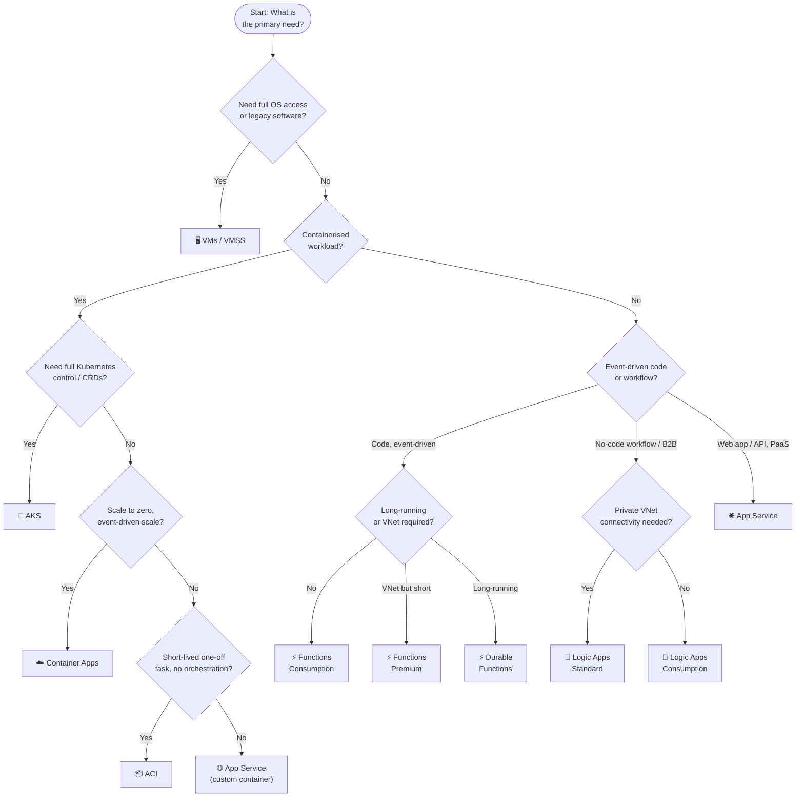

# 🎯 Exam Caveats & Quick-Reference Cheatsheet
{: .no_toc }

**Last-minute review — exam traps, decision trees, and must-memorise numbers**
{: .fs-5 .fw-300 }

---

## Table of Contents
{: .no_toc .text-delta }

1. TOC
{:toc}

---

## ⚠️ The Most Dangerous Exam Traps

### Trap 1 — Single VM SLA requires Premium SSD
> ❌ "A single VM always gets 99.9% SLA"
> ✅ The 99.9% SLA for a single VM only applies when **all disks are Premium SSD or Ultra Disk**

Standard HDD/SSD on a single VM = **no SLA**. This is a very frequent distractor.

---

### Trap 2 — Availability Set ≠ 99.99%
> ❌ "Use an Availability Set for the highest VM SLA"
> ✅ Availability Set only achieves **99.95%** — protecting against rack-level failures in one datacentre

For **99.99%**, VMs must be spread across **Availability Zones** (separate physical buildings). If the scenario specifies 99.99%, the answer is Availability Zones, not Availability Set.

---

### Trap 3 — App Service auto-scale requires Standard or above
> ❌ "Enable auto-scale on a Basic App Service Plan"
> ✅ Auto-scale is only available from **Standard tier and above**

Basic supports manual scale to a maximum of 3 instances only. If the scenario says "auto-scale based on CPU", the App Service Plan must be Standard or higher.

---

### Trap 4 — App Service VNet Integration is outbound only
> ❌ "Use VNet Integration to prevent the app from being accessed publicly"
> ✅ VNet Integration controls **outbound** traffic — the app can reach VNet resources, but it is still publicly accessible on its App Service hostname

To prevent inbound public access, use a **Private Endpoint** on the app (or deploy into ASEv3).

---

### Trap 5 — Functions Consumption has NO VNet Integration
> ❌ "Use a Consumption plan Function to call a SQL Managed Instance in a private VNet"
> ✅ The Consumption plan **does not support VNet Integration**

For a Function to reach private VNet resources, it must be on the **Premium plan** or **Dedicated (App Service) plan**.

---

### Trap 6 — Functions Consumption has a 10-minute execution timeout
> ❌ "Use a Consumption plan Function for a 30-minute data processing job"
> ✅ The Consumption plan maximum execution timeout is **10 minutes**

For long-running operations use **Durable Functions** (which can span days) or the **Premium/Dedicated plan** (which supports unlimited duration).

---

### Trap 7 — Functions Premium always has at least 1 running instance
> ❌ "Use the Premium plan to get the lowest possible cost with zero traffic"
> ✅ The Premium plan maintains a **minimum of 1 always-ready instance** — you are billed for it even with zero executions

For truly zero-cost idle, use the **Consumption plan** (scale to zero). Premium eliminates cold start but never truly idles.

---

### Trap 8 — ISE is retired; the answer is Logic Apps Standard
> ❌ "Use Integration Service Environment (ISE) for VNet-isolated Logic Apps"
> ✅ ISE was **retired in August 2024**. The replacement is **Logic Apps Standard**

Any scenario requiring private networking for Logic Apps (VNet Integration, private endpoints, on-premises without a gateway) now maps to Logic Apps Standard.

---

### Trap 9 — Logic Apps Consumption cannot reach private VNet resources natively
> ❌ "Use Logic Apps Consumption with VNet Integration to call a private API"
> ✅ Consumption plan has **no VNet Integration** — only the **Standard plan** supports it

For private connectivity from Logic Apps without a Data Gateway, the answer is always **Logic Apps Standard**.

---

### Trap 10 — Container Apps ≠ AKS when full Kubernetes is needed
> ❌ "Use Container Apps for a microservice that needs a Custom Resource Definition (CRD)"
> ✅ Container Apps abstracts Kubernetes — you **cannot use custom CRDs, custom controllers, or kubectl** directly

For full Kubernetes API access (CRDs, custom operators, StatefulSets with PVCs), the answer is **AKS**.

---

### Trap 11 — Container Apps UDR requires Dedicated plan
> ❌ "Use Container Apps Consumption plan to route all egress through Azure Firewall"
> ✅ User-Defined Routes (UDR) for egress control are only supported on the **Container Apps Dedicated plan**

Consumption plan environments do not support UDR — egress goes directly to the internet or via the integrated VNet without forced tunnelling.

---

### Trap 12 — ACI has a 4 vCPU / 16 GB limit
> ❌ "Use ACI to run a container requiring 8 vCPUs"
> ✅ ACI is capped at **4 vCPU and 16 GB RAM per container group**

For compute-intensive containers exceeding these limits, use **AKS** or **VMSS**.

---

### Trap 13 — AKS Kubenet pods are NOT directly routable from on-premises
> ❌ "Use AKS with Kubenet so on-premises systems can call pods directly"
> ✅ Kubenet uses NAT — pods do **not** get real VNet IPs. On-premises cannot route to pod IPs without going through a node IP

For pod-level accessibility from on-premises or peered VNets, use **Azure CNI**.

---

### Trap 14 — Durable Functions store state in Azure Storage automatically
> ❌ "I need to manage a database for Durable Functions state"
> ✅ Durable Functions automatically use **Azure Storage** (or Netherite / MSSQL backends) for state — no custom database needed

The orchestration history, instance state, and timers are all persisted transparently.

---

### Trap 15 — Logic Apps vs Power Automate for enterprise scenarios
> ❌ "Use Power Automate for a B2B EDI trading partner integration"
> ✅ Power Automate is for business users and does not support B2B/EDI. Use **Logic Apps** with an **Integration Account**

Power Automate shares some connectors with Logic Apps but lacks EDI (X12, EDIFACT, AS2), XML transforms, and Integration Account support.

---

### Trap 16 — Deployment slots not available on Functions Consumption
> ❌ "Use deployment slots on a Consumption plan Function App for staged releases"
> ✅ Deployment slots for Function Apps require **Premium or Dedicated (App Service) plan**

Consumption plan Functions do not support slots.

---

## 📋 Must-Memorise Numbers

### VM SLAs

| Configuration | SLA |
|--------------|-----|
| Single VM (Standard SSD or lower) | **No SLA** |
| Single VM (Premium SSD / Ultra) | **99.9%** |
| Availability Set (2+ VMs) | **99.95%** |
| Availability Zones (2+ VMs) | **99.99%** |

### App Service Plan Tier Gates

| Feature | Minimum Tier |
|---------|-------------|
| Custom domain | Shared (D1) |
| Auto-scale | **Standard** |
| Deployment slots | **Standard** (5 slots) |
| VNet Integration | **Standard** |
| Zone redundancy | **Premium v2/v3** |
| Private Endpoint | **Basic** |
| 99.99% SLA | **Isolated (ASEv3)** |

### Functions Hosting Plan Limits

| Property | Consumption | Premium | Dedicated |
|----------|------------|---------|-----------|
| Max timeout | **10 min** | Unlimited | Unlimited |
| Scale to zero | ✅ | ❌ | ❌ |
| VNet Integration | ❌ | ✅ | ✅ |
| Min instances | 0 | **1** | Fixed |
| Cold start | Yes | No | No |

### Container Limits

| Service | Max vCPU | Max RAM |
|---------|---------|---------|
| ACI | **4 vCPU** | **16 GB** |
| Container Apps (Consumption) | **4 vCPU** | **8 GB** per replica |
| AKS | Node size × replicas | Node size × replicas |

### SLA Summary

| Service | SLA Range |
|---------|-----------|
| Single VM (Premium SSD) | 99.9% |
| App Service (Basic–Premium) | 99.95% |
| App Service Environment | **99.99%** |
| AKS (Standard, no AZ) | 99.95% |
| AKS (Standard + AZ) | **99.99%** |
| ACI | 99.9% |
| Container Apps | 99.95% |
| Azure Functions (all plans) | 99.95% |
| Logic Apps Consumption | 99.9% |
| Logic Apps Standard | 99.95% |

---

## ⚡ Decision Tree — Choosing the Right Compute Service

---

## 🃏 Flash Card — One-Line Definitions

| Service | One-Line Definition |
|---------|-------------------|
| **VMs / VMSS** | IaaS — full OS control, lift-and-shift, scale sets for elastic VM fleets |
| **App Service** | PaaS web hosting — managed runtime, deployment slots, VNet Integration on Standard+ |
| **AKS** | Managed Kubernetes — full K8s API, custom CRDs, free control plane with Standard tier SLA |
| **ACI** | Serverless containers — instant, ephemeral, 4 vCPU max, per-second billing |
| **Container Apps** | Serverless container platform — KEDA scaling, Dapr, revisions, scale to zero |
| **Functions** | Serverless code — trigger-based, Consumption = scale-to-zero + 10min limit, Premium = VNet + no cold start |
| **Logic Apps** | Serverless workflow — 500+ connectors, B2B/EDI; Standard = VNet + multiple workflows |

---

## 🔑 Feature Lock-In Summary

| If the exam says… | The answer is… |
|------------------|---------------|
| Highest VM SLA | VMs across **Availability Zones** (99.99%) |
| Single VM + 99.9% SLA | **Premium SSD** on all disks |
| 99.99% SLA for App Service | **App Service Environment v3** (Isolated tier) |
| Auto-scale on App Service | **Standard plan or above** |
| App calls private VNet resource | App Service **VNet Integration** (Standard+) or Functions **Premium** |
| App is NOT publicly accessible | App Service / Functions **Private Endpoint** |
| Full Kubernetes API access | **AKS** |
| Containers, scale to zero, KEDA | **Azure Container Apps** |
| Containers, no orchestration, short-lived | **ACI** |
| Functions + VNet Integration | **Premium plan** (not Consumption) |
| Functions + no cold start | **Premium plan** (Always Ready instances) |
| Functions + execution > 10 min | **Durable Functions** or **Premium/Dedicated plan** |
| Stateful long-running workflow in code | **Durable Functions** |
| No-code workflow with 500+ connectors | **Logic Apps** |
| Logic Apps + VNet / private connectivity | **Logic Apps Standard** (not Consumption) |
| ISE replacement | **Logic Apps Standard** |
| B2B EDI (X12, AS2, EDIFACT) | **Logic Apps** + **Integration Account** |
| Canary / blue-green on serverless containers | **Container Apps revision traffic split** |
| All egress from containers through a firewall | **Container Apps Dedicated plan** (UDR support) |
| Batch job on cheapest serverless container | **ACI** (or Container Apps Consumption) |
| Spot VMs for batch workers | **VMSS Spot node pool** |
| Physical single-tenant isolation | **Azure Dedicated Hosts** |

---

## ✅ Final Exam Checklist

Before sitting the exam, verify you can answer these without hesitation:

- [ ] What disk type does a single VM need for a 99.9% SLA?
- [ ] What SLA does an Availability Set provide, and how does it differ from Availability Zones?
- [ ] What App Service Plan tier is needed for auto-scale?
- [ ] What is the difference between VNet Integration and Private Endpoint on App Service?
- [ ] What is ASEv3 and when is it the right answer?
- [ ] What are the three Functions hosting plans and their key differences?
- [ ] Why can't a Consumption plan Function call a private SQL Managed Instance?
- [ ] What is the execution timeout on a Consumption plan Function?
- [ ] What are Durable Functions and which patterns exist?
- [ ] What replaced ISE for Logic Apps VNet connectivity?
- [ ] What is the difference between Logic Apps Consumption and Standard?
- [ ] When should you choose Container Apps over AKS?
- [ ] What are Container Apps Revisions used for?
- [ ] What is KEDA and what triggers does Container Apps support?
- [ ] What is the maximum vCPU limit for an ACI container group?
- [ ] What AKS networking mode gives pods real VNet IP addresses?

---

[← 08 — Feature Comparison](/az-305-compute/08-feature-comparison/) | [Back to Home →](/az-305-compute/)